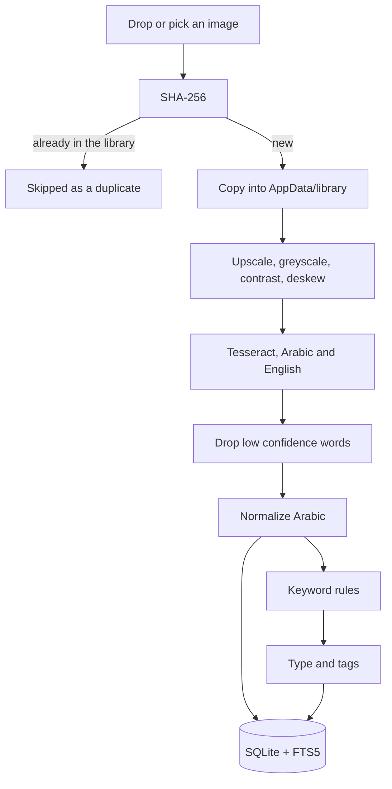

<div align="center">


# ورقي / Waraqi

**An offline document archive that reads Arabic and English.**

Photograph your documents, Waraqi reads the text out of them, and you can search
that text later. Everything happens on your machine. No account, no server, and
no network call at any point, including the first run.

</div>

## Why

Tools that do this already exist. They assume a server you have to run, and they
treat Arabic as an afterthought when they support it at all. That combination
puts them out of reach of the people who need them most: anyone holding a folder
of contracts, IDs, prescriptions and invoices they cannot search.

Most paperwork here is not in one language. A single page carries an Arabic
header, an English form field and a number in either script. So Waraqi reads both
on every page, and searching works the same whichever you type.

## What it does

- Import by dragging photos onto the window or through a file picker
- OCR in Arabic and English together on every page, including mixed documents
- Full text search in either language, with Arabic normalization so فاتوره finds فاتورة
- Tags, searchable, with a sidebar showing counts
- Tags applied automatically from what is actually written on the page
- A rule based guess at the document type, no model involved
- Export one document as a searchable PDF
- Export the whole archive as plain files plus a CSV that opens anywhere

## How a document moves through it



The copy in step three is not tidiness. The webview is only allowed to display
files inside the app's own data folder, so importing has to move the file there
before it can ever be shown.

## Both languages, one page

Every page goes through both the Arabic and the English model, so a document with
an Arabic header and English form fields comes out whole.

English mostly takes care of itself. Arabic does not, and that is where the work
went.

The same word is written several ways. Diacritics are optional, alef carries
hamza or not, taa marbuta and haa get swapped, numerals come in two sets. So every piece of text is
normalized before it is indexed, and every query is normalized the same way.
SQLite's own tokenizer does none of this for Arabic, which is why searching an
Arabic archive usually fails.

```js
normalize('إيجار')  === normalize('ايجار')   // hamza
normalize('مُسْتَشْفَى') === normalize('مستشفي')   // diacritics
normalize('١٥٠٠')   === '1500'              // numerals
```

Those three cases are covered by tests. Run `npm test`.

Tags and document types follow the same rule and are matched in both languages.
A page reading "Passport" is tagged Passport, one reading جواز سفر is tagged
جواز سفر, and the app's own interface flips between Arabic and English with the
layout mirroring correctly.

## Offline is the point too

Everything OCR needs is committed in this repository: the Arabic and English
language models, the Tesseract WebAssembly core, and the Amiri font used for
Arabic in exported PDFs. A fresh clone builds and runs with nothing downloaded,
and the application makes no network requests at all.

Your documents live in one folder inside the app's data directory, alongside a
single SQLite database. Delete that folder and the app is empty again. The
archive export exists so you can walk away with everything, readable without
Waraqi.

## Running it

Needs Node 20 or later and Rust.

```bash
npm install
npm run tauri dev
```

Build an installer:

```bash
npm run tauri build
```

Run the tests:

```bash
npm test
```

## How it is put together

Tauri 2 for the shell, vanilla JavaScript for the frontend, SQLite for storage.
No framework.

```
src/lib/    arabic.js normalization, db.js schema and FTS triggers,
            prep.js image preprocessing, ocr.js Tesseract,
            importer.js the pipeline, search.js, tags.js, types.js, export/
src/ui/     library grid, document viewer, import handling, tag sidebar
public/     language models, Tesseract core, Amiri font
```

Search runs on SQLite FTS5 with an external content table, so the index is kept
in sync by triggers rather than storing the text twice. Tesseract runs in a
worker with its models read from disk.

## Licence

MIT, see [LICENSE](LICENSE). Third party components and their licences are listed
in [THIRD_PARTY.md](THIRD_PARTY.md).
